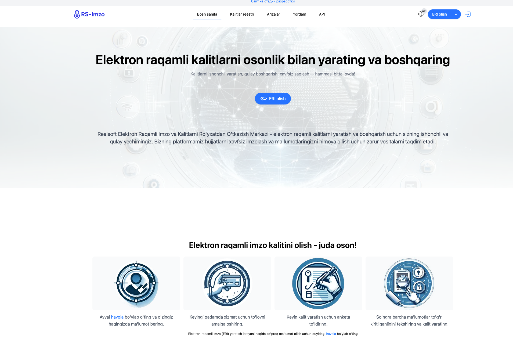
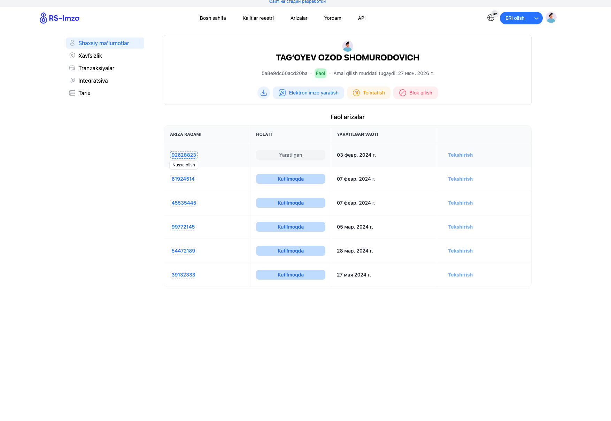
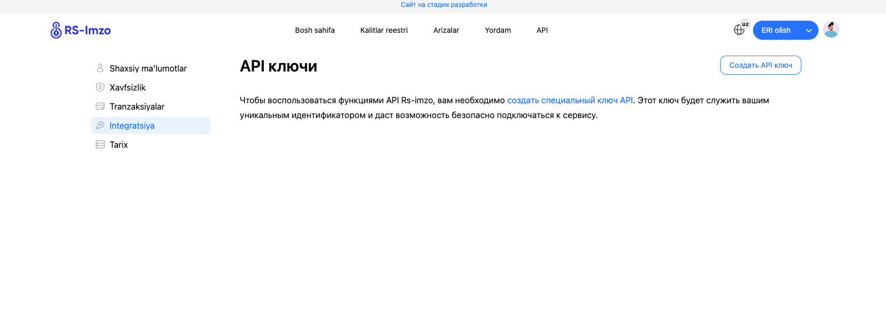

# RS-Imzo-Integration
## Instruction for Integration of RS-Imzo Clients(backend)

### The Client first of all should create an electronic digital signature(ERI) from https://rs-imzo.uz/ :


### After getting Signature, he/she should log in to personal profile: 


### Then go to integration page of personal profile for creating an api key for your project in order to use with RS-Imzo: 


### After creating api key, save it for yourself in a secure place, because if you lose it you may not integrate with RS-Imzo.

### Then for your backend project you will need to add an external library that we posted in here. After adding the library, now it is time for you to use the methods written in our library.
### 1. `generateToken(String apiKey)`

```
    public ResponseEntity<String> generateToken(String API_KEY) {
    
        URL baseUrl = new URL("https://api.rs-imzo.uz");

        Client client = new HttpClient(baseUrl);
        
        return ResponseEntity.ok(client.generateToken(API_KEY));
    }
```

Response For this api request will be : 
```
{
    "token": "eyJhbGciOiJIUzI1NiJ9...DZpyDuTOlmPP0NpT8MT85QILORHiFQG90OcZJDWT0-s"
}
```
<strong> API_KEY is the key that we have provided to you during the process of creating api key. There will be testApiKEy also given to you, you can use it for test purposes.</strong>


### 2. `verifyPkcs7(String pkcs7b64, Map<String, String> headers)`

```
    public ResponseEntity<ParsePkcs7> verifyPkcs7(String pkcs7b64, Map<String, String> headers) {

        URL baseUrl = new URL("https://api.rs-imzo.uz");

        Client client = new HttpClient(baseUrl);
        
        Map<String, String> header = Map.of(
            "rs-user-agent" to headers!!["user-agent"].toString(),
            "rs-referer" to headers["referer"],
            "rs-x-real-ip" to headers["x-real-ip"]
        );

        ParsePkcs7 pkcs7Info = client.verifyPkcs7(pkcs7b64, header);
        
        return ResponseEntity.ok(pkcs7Info);
    }
```

<strong> The pkcs7 in base64 format will be like this String pkcs7b64 = "MIAGCSqG...6bAAAAAAAA"; It can be taken by your Signature</strong>

Response for VerifyPkcs7 will be similar to this: 
```
{
  "data": "ZDQ0ZDRkYWNhN2FmNDg2NDhkNTRlYmM3MzA2YWU0YzM=",
  "detached": false,
  "signers": [
    {
      "certificate": {
        "extensions": [
          {
            "oid": "crlDistributionPoints",
            "value": "https://ca.realsoft.uz/crl"
          },
          {
            "oid": "subjectKeyIdentifier",
            "value": "47a3c53fc576966597144745b8da8b4be89dd136"
          },
          {
            "oid": "authorityKeyIdentifier",
            "value": {
              "keyid": "a1751d010a52e8ca17c68630431eebba07d18540",
              "serial": "19af26b5f2935f4d"
            }
          }
        ],
        "inbase64": "MIIDcjCCAvmgAwIBAgIIWo6dxgrNILowCgYIKoZIzj0EAwIwgbIxCzAJBgNVBAYTAlVaMR8wHQYJKoZIhvcNAQkBFhBpbmZvQHJlYWxzb2Z0LnV6MSowKAYDVQQHDCFUb3Noa2VudCBzaC4gS2ljaGlrIHhhbHFhIHlvbGkgMzgxPjA8BgNVBAsMNdCeY2hpcSBrYWxpdCBzZXJ0aWZpa2F0bGFyaW5pIHJvJ3l4YXRnYSBvbGlzaCBtYXJrYXppMRYwFAYDVQQKDA1SRUFMU09GVCBNQ0hKMB4XDTI0MDYyNjEyNTUwMFoXDTI2MDYyNzEyNTUwMFowUjELMAkGA1UEBhMCVVoxGzAZBgcqhlwDEAECDA4zMTMwNDk4NTU0MDAxOTEmMCQGA1UEAwwdVEFH4oCYT1lFViBPWk9EIFNIT01VUk9ET1ZJQ0gwdjAQBgcqhkjOPQIBBgUrgQQAIgNiAASOjc0XiFqWOP+pculxUbNoLFObrmFVoHiibXuG/IrEUmNmFx7eWhbGSRgy9o/63LMU/4uXmtzMXYxhcnrwAOUiRd5gTInu9/2KBoK4dguSIE7RtbFnAsV8LUKodS80ilyjggE5MIIBNTArBgNVHR8EJDAiMCCgHqAchhpodHRwczovL2NhLnJlYWxzb2Z0LnV6L2NybDAdBgNVHQ4EFgQUR6PFP8V2lmWXFEdFuNqLS+id0TYwgeYGA1UdIwSB3jCB24AUoXUdAQpS6MoXxoYwQx7rugfRhUChgbikgbUwgbIxCzAJBgNVBAYTAlVaMR8wHQYJKoZIhvcNAQkBFhBpbmZvQHJlYWxzb2Z0LnV6MSowKAYDVQQHDCFUb3Noa2VudCBzaC4gS2ljaGlrIHhhbHFhIHlvbGkgMzgxPjA8BgNVBAsMNdCeY2hpcSBrYWxpdCBzZXJ0aWZpa2F0bGFyaW5pIHJvJ3l4YXRnYSBvbGlzaCBtYXJrYXppMRYwFAYDVQQKDA1SRUFMU09GVCBNQ0hKgggZrya18pNfTTAKBggqhkjOPQQDAgNnADBkAjBSK1pXUyXzElcLF2PmKcjWLhYrojaKDoKOIikKlj2KJymQvr+vzpjiiw1bKWrgff8CMD/FSuCXadgUM6DVymcofQv0hs49lFevs/Jzb2IJT9tvDOnMvPF838PMVYGWvWUVtQ==",
        "issuer": {
          "C": "UZ",
          "O": "REALSOFT MCHJ"
        },
        "serial": "5a8e9dc60acd20ba",
        "signature_algorithm": "ecdsa-with-SHA256",
        "subject": {
          "1.2.860.3.16.1.2": "00000000000000",
          "C": "UZ",
          "CN": "AZIZOV AZIZ AZIZOVICH"
        },
        "subject_public_key_info": {
          "algorithm": "id-ecPublicKey",
          "public_key": "BI6NzReIWpY4/6ly6XFRs2gsU5uuYVWgeKJte4b8isRSY2YXHt5aFsZJGDL2j/rcsxT/i5ea3MxdjGFyevAA5SJF3mBMie73/YoGgrh2C5IgTtG1sWcCxXwtQqh1LzSKXA=="
        },
        "validity": {
          "not_after": 1782564900,
          "not_before": 1719406500
        },
        "version": 2
      },
      "digest": "d37d555f74f9dd4a88eca36dd191443be21ee922e84cf8d26af367f8fd1fcb20",
      "signed_time": 1719897708,
      "verified": true
    }
  ]
}
```

### 3. `mergePkcs7(String pkcs7b64, Map<String, String> headers)`

```
    public ResponseEntity<String> verifyPkcs7(String oldPkcs7b64, String currentPkcs7b64) {

        URL baseUrl = new URL("https://api.rs-imzo.uz");

        Client client = new HttpClient(baseUrl);
       
        String mergedPkcs7b64 = client.mergePkcs7(oldPkcs7b64, currentPkcs7b64);
        
        return ResponseEntity.ok(mergedPkcs7b64);
    }
```

<strong> After merging you will get a newly generated pkcs7 in base64 format, if you try to verify it by sending verifyPkcs7, your parsed pkcs7 will contain 2 or more signers in it.</strong>

